# Software Composition Analysis

- Typically a form of SAST, as it is testing the source code where the dependencies are managed.
- A software is often developed with the help of third party dependencies. We are trying to determine if all the dependencies used are upto the latest versions or are vulnerable to common vulnerabilities and Exposures (CVE).
- well suited for CI/CD pipelines.

## Synk

- an organization that develops security tools as Software as a Service(Saas),that helps us to secure:
        
    - Source code
    
    - Third party/Opensource libraries or dependencies.
    - Containers
    - Infrastructure as Code

### Create an account with Synk

Go to  and click login

Login using GitHub

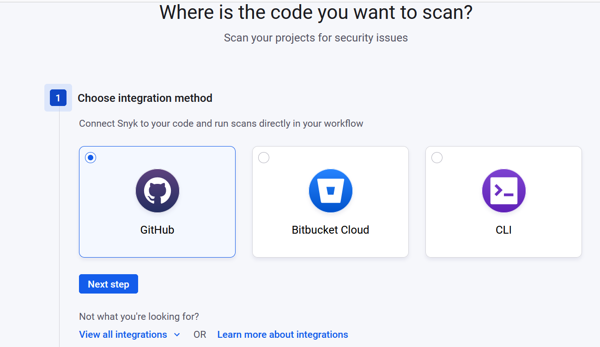

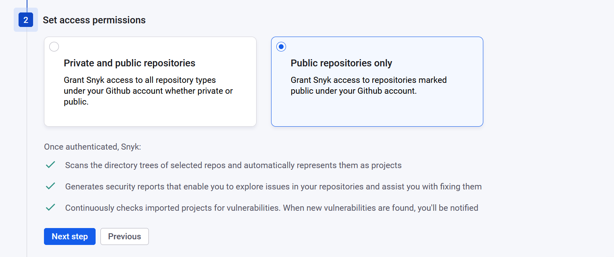

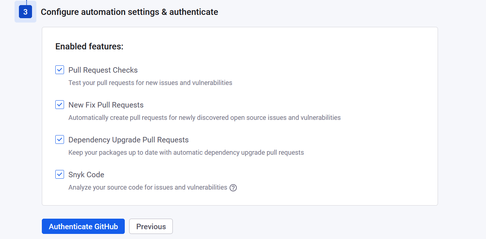

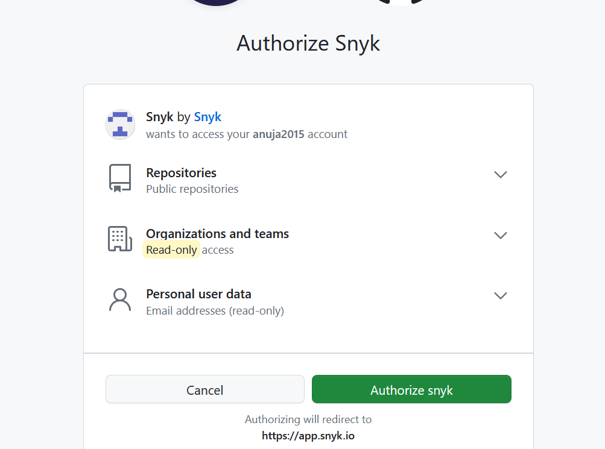

### Auth Token need for jenkins

Go to your profile -> Account settings

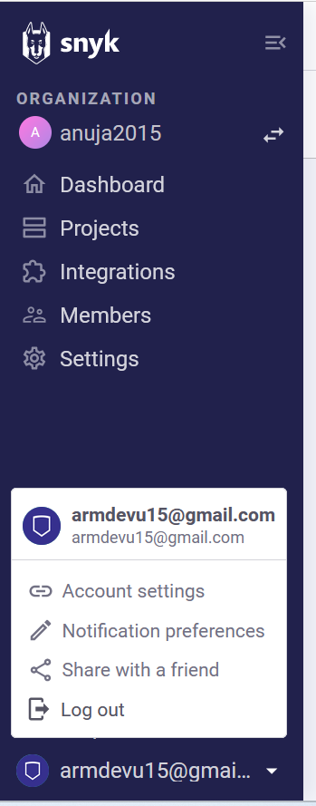

General -> Auth Token -> Click to show

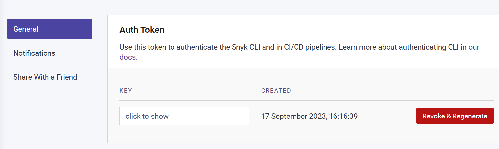

## Integrate Synk with Jenkins pipelines

For a Java project

1. Make changes to pom.xml as below and commit to the repo.

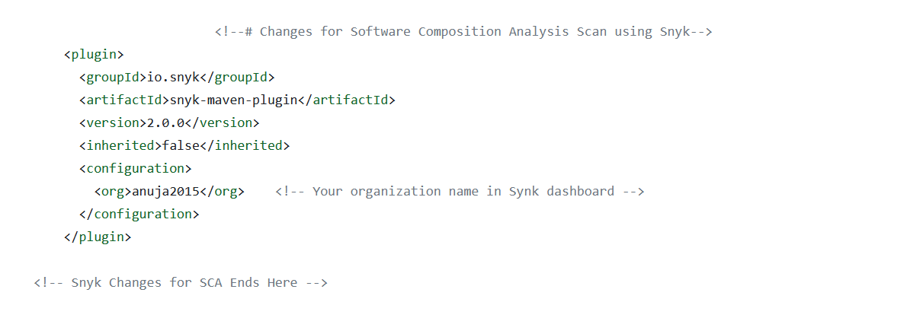

2. Add Synk Auth Token in Jenkins credentials

Manage Jenkins -> credentials -> System -> Global credentials -> Add credentials

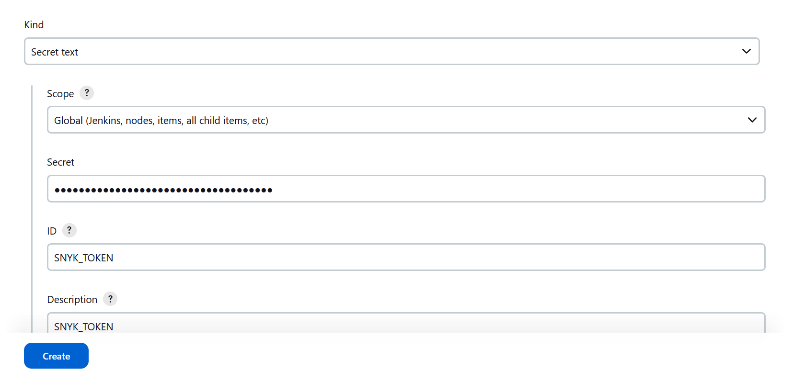

3. Make changes to Jenkins file and commit to the repo.

4. Create a pipeline job in jenkins

5. Configure the job

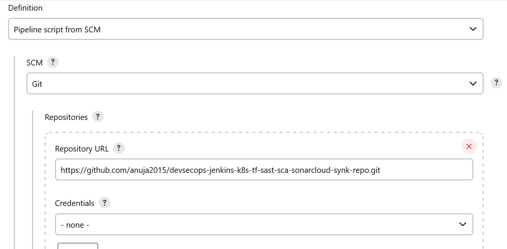

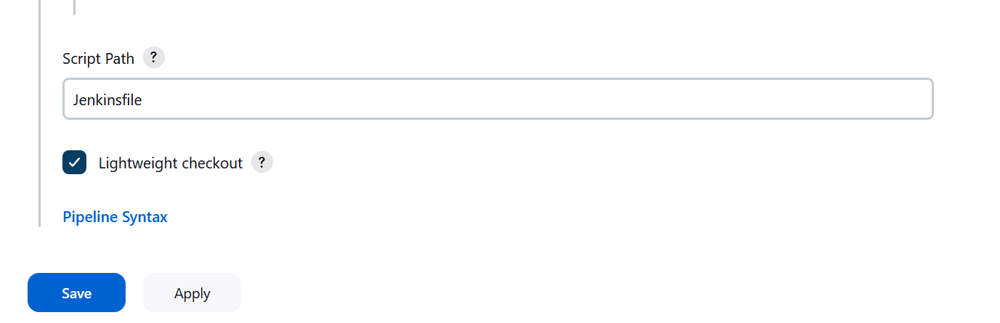

6. Run the job

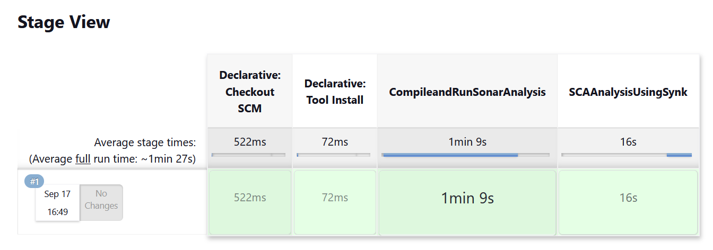

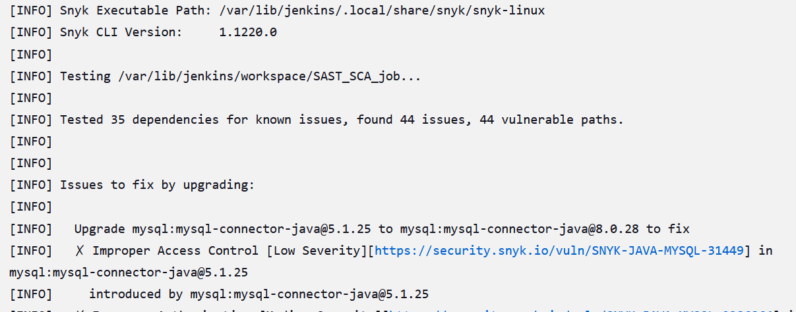

